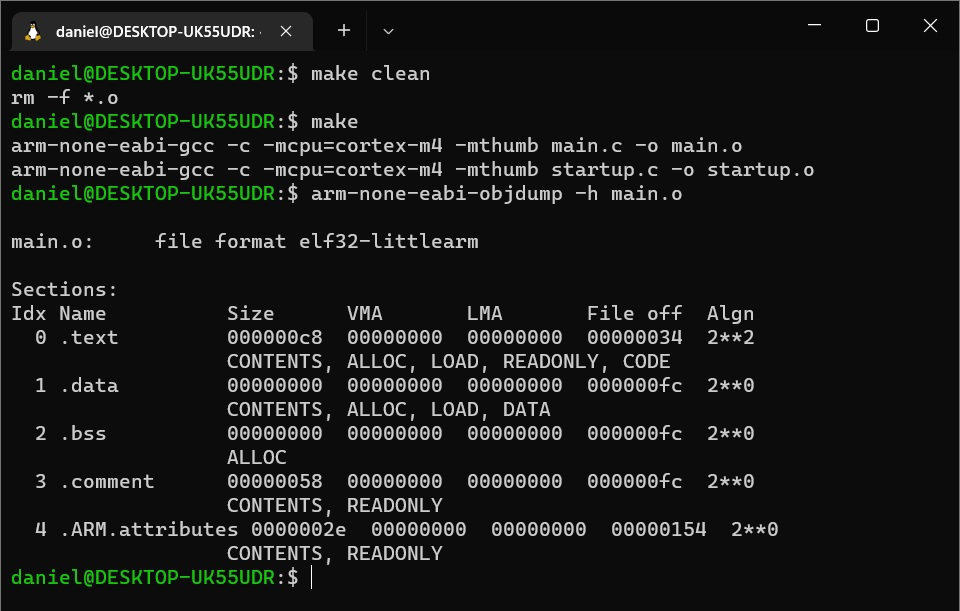
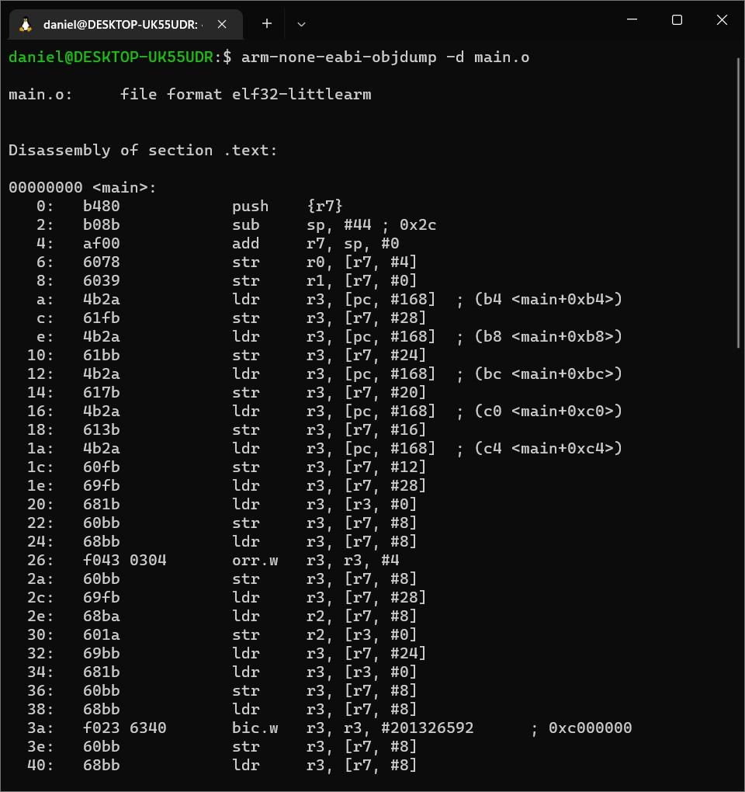
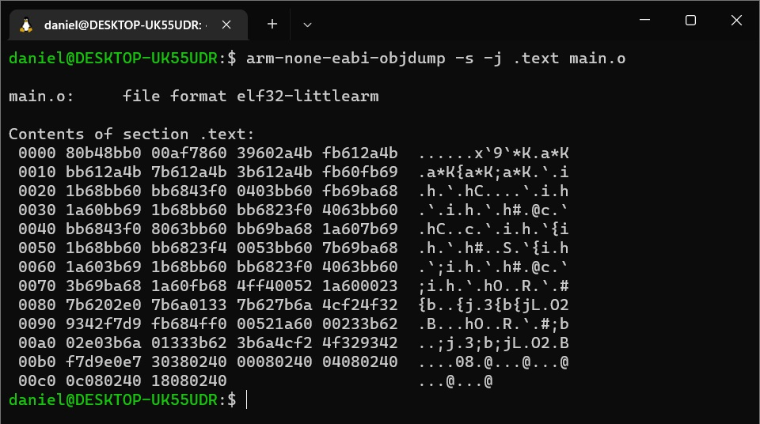
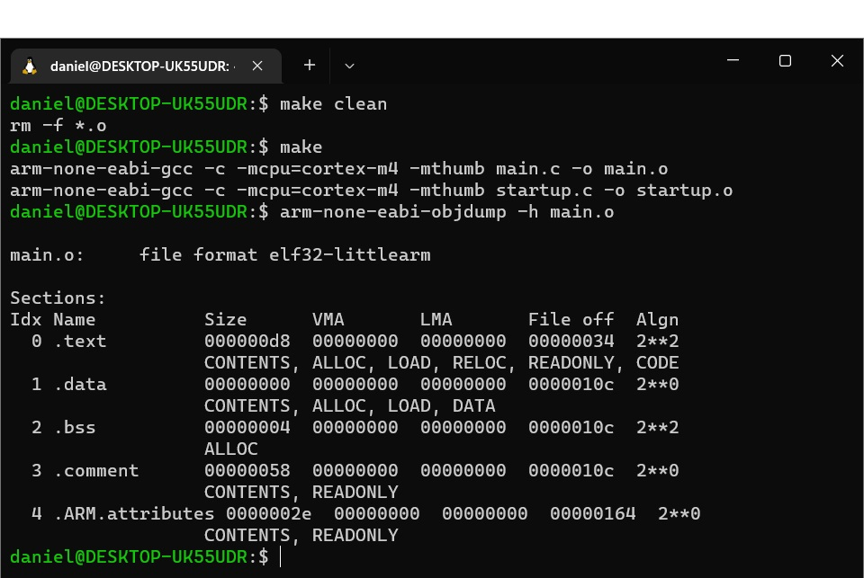
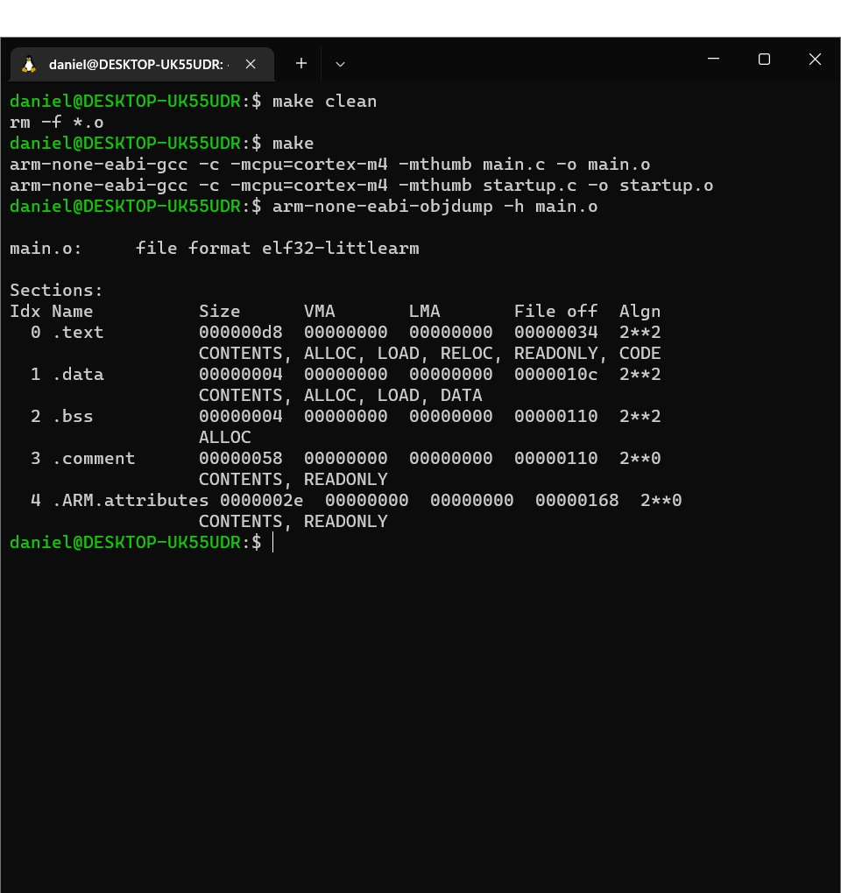
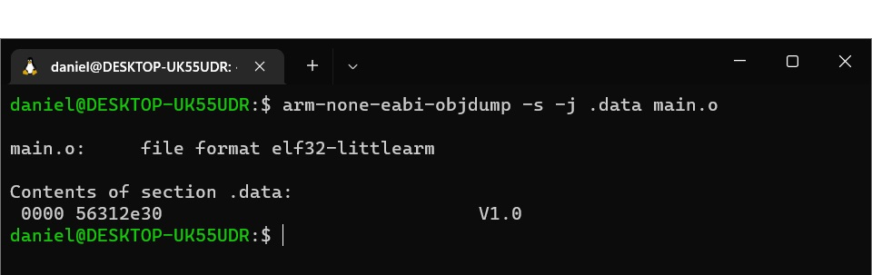
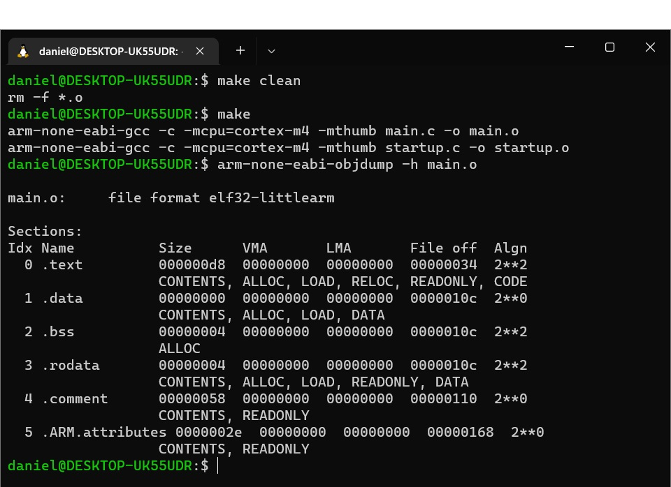
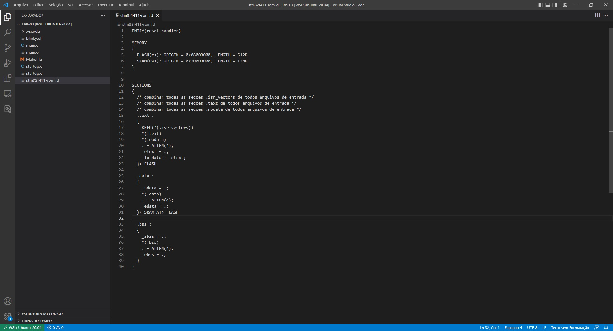

# Laboratório 03

## 1 - Objetivos

Neste laboratório iremos continuar a implementação do programa para piscar o LED
integrado ao kit de desenvolvimento **STM32F411 Blackpill**.

No laboratório de hoje iremos abordar os seguintes temas:

* utilizar o periférico GPIO para piscar o LED;
* utilizar o periférico GPIO para alterar a frequência do LED;
* analizar arquivos objeto realocáveis;
* escrever o arquivo ***linker script***;
* gerar e analizar o ***map file***;
* 

## 2 - Pré-requisitos

* Windows Subsystem for Linux 2;
* GCC - GNU C Compiler;
* GCC ARM Toolchain;
* OpenOCD - Open On Chip Debugger;
* Sistema de controle de versões Git, e;
* Microsoft Visual Studio Code.

## 3 - Referências

[1] [STM32F411 Blackpill Schematic](https://cdn-shop.adafruit.com/product-files/4877/4877_schematic-STM32F411CEU6_WeAct_Black_Pill_V2.0.pdf)

[2] [STM32F411xC Datasheet]()

[3] [RM0383 Reference Manual](https://www.st.com/resource/en/reference_manual/rm0383-stm32f411xce-advanced-armbased-32bit-mcus-stmicroelectronics.pdf)

[4] [Using the GNU Compiler Collection (GCC)]()

[5] [Using ld, the GNU linker](http://www.nacad.ufrj.br/online/sgi/860-0247-001/sgi_html/ld.html)

## 4 - Analizar arquivos objeto realocáveis

Ao se compilar um arquivo utilizando o GCC são gerados arquivos objeto em um
formato de arquivo padrão denominado **ELF (Executable and linkable format)**.
Existem diversos outros formatos, por exemplo:

* **COFF (The Common Object File Format)** - Introduzido pelo UNIX System V;
* **AIF (ARM Image Format)** - Introduzido pela ARM;
* **Portable Executable (PE)** - Utilizado pelo Windows para arquivos como .exe
ou .dll;
* **SRECORD** - Introduzido pela Motorola.

A partir do formato **ELF** podemos utilizar as ferramentas fornecidas pelo
**toolchain** para criar outros formatos de arquivo binário como **.bin**,
**.ihex (Intel hex)**, **.srec (S Record)**, entre outros.

O padrão de arquivo **ELF** especifica uma forma de organizar diversos elementos
do programa: *data*; *read-only data* (constantes); *code*; 
*uninitialized data*; * etc em diferentes seções. As seções mais relevantes do
formato **ELF** são:

* **.text**: armazena o código ou as instruções do programa;

* **.data**: armazena os dados do programa, mais especificamente esta seção
armazena os dados pré-inicializados do programa;

* **.bss**: armazena os dados não inicializados inicializados do programa;

* **.rodata**: armazena os dados de leitura apenas, por exemplo, as contantes.

Para analizar o arquivo objeto **main.o** podemos utilizar a ferramenta
**arm-none-eabi-objdump** fornecida pela **GNU Arm Embedded Toolchain**. Esta
ferramenta extrai o conteúdo de arquivos objeto e tem a seguinte sintaxe: 

**arm-none-eabi-objdump <option(s)> <file(s)>**

para se obter uma lista das opções aceitas basta executar o programa sem nenhuma
opção e não indicar nenhum arquivo.

```console
foo@bar:~$ arm-none-eabi-objdump
```

Por exemplo, para extrair o conteúdo dos cabeçalhos das seções utilize a
opção **-h**

```console
foo@bar:~$ arm-none-eabi-objdump -h main.o
```



A primeira linha indica que o formato do arquivo é elf32, little-endian, ou 
seja, ao armazenar uma palavra na memória, os bytes menos significativos são
armazenados nos endereços mais baixos da memória, e a arquitetura é arm. Em
seguida temos as seções do arquivo objeto que, para este arquivo, são cinco:
**.text**, **.data**, **.bss**, **.comment** e **.ARM.attributes**.

Toda seção "carregável" (**loadable**), ou alocável, (**allocatable**), possui
dois endereços. O primeiro é o VMA (**Virtual Memory Address**). Este é o
endereço que a seção irá ter quando o arquivo for "executado". O segundo é o
LMA (**Load Memory Address**). Este é o endereço no qual a seção será 
carregada. Na maioria das vezes os dois endereços serão os mesmos. Um exemplo
de quando serão diferentes é a seção **.data** que é salva na **FLASH** e,
durante a inicialização, tem seus dados copiados para a memória **SRAM**. Esta
técnica é frequentemente utilizada em sistemas embarcados baseados em **FLASH**
para inicializar variáveis globais. Neste caso o endereço da **FLASH** será o
LMA e o endereço na **SRAM** o LMA. Como o código ainda é relocável, os
endereços não foram definidos e estão com valores zerados. No executável final
será possível ver valores diferentes de zero.

Como dito anteriormente a seção **.text** armazena o código do programa e, neste
caso, possui tamanho **0xc8**. Podemos analizar o conteúdo desta seção fazendo o
***disassembly*** do código

```console
foo@bar:~$ arm-none-eabi-objdump -d main.o
```



Note que o endereço base da função **main()** é **0x0000 0000**. Este não é o
endereço que o código da função irá ocupar, ao final, na memória do
microcontrolador uma vez que sabemos que a faixa de endereços ocupada pelo
código no STM32 se inicia em **0x0800 0000**. Novamente, a posição final que o
código irá ocupar será determinada durante o processo de ***linking*** de
acordo com as configurações fornecidas pelo *linker script*. Por esta razão
chamamos o arquivo **main.o** de arquivo objeto realocável. Perceba também que
existem instruções de 16 e de 32 bits, algo normal para o **ARM Cortex-M** e
seu conjunto de instruções T32.

Outra forma de vizualizarmos o conteúdo de uma seção é realizar um ***hexdump***
do contéudo da seção. Por exemplo:

```console
foo@bar:~$ arm-none-eabi-objdump -s -j .text main.o
```



As seções **.data** e **.bss** armazenam as variáveis inicializadas e não
inicializadas, respecectivamente. Como podemos observar seu tamanho é 0, não
temos variáveis globais no nosso programa. Para ententer melhor como estas
seções funcionam alterar nosso programa para criar uma variável global que irá
armazenar o estado do LED.

```c
  .
  .
static uint32_t led_status;

int main(int argc, char *argv[])
{
  .
  .
  .
  while(1)
    {
      *pGPIOC_BSRR = GPIO_BSRR13_SET;
      led_status = 0;
      for (uint32_t i = 0; i < LED_DELAY; i++);
      *pGPIOC_BSRR = GPIO_BSRR13_RESET;
      led_status = 1;
      for (uint32_t i = 0; i < LED_DELAY; i++);
    }

  return EXIT_SUCCESS;
}
```

Ao recompilar e checar novamente o conteúdo das seções do arquivo objeto vemos
que agora o tamanho da seção **.bss** é 4 bytes, equivalente ao tamanho da
variável **led_status**.

```console
foo@bar:~$ arm-none-eabi-objdump -h main.o
```



O conteúdo da seção **.bss** não é muito interessante pois ela apenas armazena
*arrays* e variáveis não inicializadas que devem ser preenchidas com 0 pelo
***loader*** antes do início do programa. O mesmo não acontece com a seção
**.data**, que vamos explorar a seguir.

Crie um *array* para armazenar informações referentes à versão do programa.

```c
  .
  .
static char     fw_version[] = {'V', '1', '.', '0'};
static uint32_t led_status;
  .
  .
```

Agora, ao recompilar e checar o conteúdo das seções do arquivo objeto vemos que
agora o tamanho da seção **.data** é de 4 bytes, equivalente aos 4 caracteres
armazenados no *array* **fw_version[]**.

```console
foo@bar:~$ arm-none-eabi-objdump -h main.o
```



Se fizermos um ***hexdump*** da seção **.data** teremos

```console
foo@bar:~$ arm-none-eabi-objdump -s -j .data main.o
```



segundo a tabela ASCII os números 0x56, 0x31, 0x2e e 0x30 equivalem aos
caracteres 'V', '1', '.' e '0' respectivamente.

As informações sobre a versão do software não deveriam ser alteradas durante a
execução do programa. Assim, é mais seguro declarar esta variável como sendo
constante.

```c
  .
  .
static const char fw_version[] = {'V', '1', '.', '0'};
static uint32_t   led_status;
  .
  .
```

Ao recompilar e checar o conteúdo das seções do arquivo objeto vemos que agora
o tamanho da seção **.data** é 0 e temos uma nova seção, **.rodata**, com
tamanho equivalente aos 4 caracteres armazenados no *array* **fw_version[]**.
Como dito anteriormente, esta seção armazena os dados de leitura apenas.

```console
foo@bar:~$ arm-none-eabi-objdump -h main.o
```



Se fizermos um *hexdump* da seção **.rodata** teremos exatamente o mesmo
conteúdo da seção **.data** anterior à modificação

```console
foo@bar:~$ arm-none-eabi-objdump -s -j .rodata main.o
```


## 5 - Escrever o arquivo **linker script**

Ao final do processo de compilação temos um conjunto de arquivos objeto.
Entretanto, estes arquivos ainda estão incompletos. Normalmente um programa em
linguagem C traz referências a funções que se encontram nas bibliotecas padrão
ou, em muitos casos, faz referências a variáveis, funções e bibliotecas privadas
definidas pelos programadores do projeto.

Após compilarmos com sucesso nosso programa devemos combinar os arquivos objetos
de modo a resolver estas pendências e combinar os arquivos objeto em um único
arquivo executável. Este processo é chamado de **linkedição**, ou ***linking***
em inglês, e é realizado **linker**. O **linker** tem por objetivo juntar o
código objeto (relocável) em um local e gerar um único arquivo executável, com
endereçamento em posição fixa no caso dos microcontroladores em **bare metal**.
Caso ocorra algum erro no processo de **linkedição**, retorna-se ao código
fonte para identificar e corrigir o erro e depois, compilar e linkar novamente
o código. Se não ocorrer nenhum erro, então o processo prossegue até gerar o
programa executável.

A linkedição é controlada por um arquivo denominado **linker script** escrito
na linguagem ***linker command language***. O principal objetivo do
**linker script** é descrever como as seções dos arquivos objeto de entrada
devem ser mapeados e controlar o ***layout*** da memória no arquivo de saída.
Entretanto, quando necessário, o **linker** também pode realizar outras
operações utilizando **linker commands**. Consulte a referência [1] para mais
detalhes.

Como dito anteriormente, o **linker script** é um arquivo de texto que descreve
como as diferentes seções dos arquivos objetos realocáveis deverão ser
combinadas para gerar o arquivo objeto executável. Além disso, durante o
processo de linkedição serão atribuídos os endereços absolutos das diferentes
seções do arquivo objeto executável. Para isso o **linker script** inclui
informações sobre os endereços de código e dados do dispositivo.

Os principais comandos utlizados em um *linker script* são:

* **ENTRY**;
* **MEMORY**;
* **SECTIONS**;
* **KEEP**;
* **ALIGN**; e;
* **AT>**.

O comando **ENTRY** é utilizado para informar o endereço do ponto de entrada,
*Entry Point Address*, no cabeçalho do arquivo objeto executável. No nosso caso
o ponto de entrada da nossa aplicação é a função **reset_handler()**, o primeiro
código a ser executado pelo processador após o *reset*.

Este comando não é obrigatório mas o **debugger** utiliza esta informação para
identificar a primeira função a ser executada. A sintaxe do comando **ENTRY** é

```ld
ENTRY(_symbol_name_)
```

Vamos começar nosso *linker script* pelo comando **ENTRY**. Crie um novo arquivo
chamado **stm32f411-rom.ld** e em seguida digite

```ld
ENTRY(reset_handler)
```

O comando **MEMORY** descreve o *layout* de memória do dispositivo, isto é, o
endereço e o tamanho das memórias ROM e RAM. O **linker** irá utilizar estas
informações para atribuir endereços às seções de memória combinadas. Esta
informação também é utilizada para que o **linker** indique uma mensagem de
erro caso não seja possível alocar na memória disponível as seções de código,
de dados, a pilha, etc.

Por meio do comando **MEMORY** você pode configurar precisamente as várias
memórias disponíveis no seu dispositivo e fazer com que diferentes seções
ocupem diferentes regiões na memória. Tipicamente um *linker script* possui
apenas um comando **MEMORY**.

A sintaxe do comando **MEMORY** é:

```ld
MEMORY
{
  NAME(attr): ORIGIN = origin, LENGTH = len
}
```

**NAME** define um nome para a região de memória que está sendo criada de forma
que esta região possa ser referenciada em outras parte do *linker script*. No
corpo do comando podemos definir quantas regiões forem necessárias. **ORIGIN**
é o endereço inicial da região de memória e **LENGTH** é o tamanho desta região.

Para cada região de memória deve ser informada uma lista de atributos. Os
atributos válidos são:

* **r** - seção somente de leitura. Utilizada para descrever memórias ROM;
* **w** - seção de leitura e escrita. Utilizada para descrever a memória RAM;
* **x** - seção que contém código executável. Pode ser utilizada em memórias ROM
ou RAM;
* **a** - seções alocadas;
* **i** - seções inicializadas, e; 
* **!** - inverte o sentido do atributo.

Para obtermos os endereços de início e o tamanho de cada região de memória
devemos utilizar o *datasheet* do STM32F411. De acordo com o *datasheet* temos:

* **Flash Memory** - endereço de origem *0x0800 0000* e endereço final 
*0x0807 FFFF* com tamanho total de 512KB;

* **SRAM** - endereço de origem *0x2000 0000* e endereço final *0x2002 0000*
com tamanho total de 128KB;

Com estas informações podemos escrever o comando **MEMORY** no nosso
*linker script*.

A primeira seção que iremos definir é a seção **FLASH**. Esta seção irá
armazenar o código do nosso programa e, não pode ser escrita por nosso
programa. Portanto, esta seção possui os atritutos **rx**.

A outra seção que iremos definir é a seção **SRAM**. Este tipo de memória é do
tipo leitura e escrita e também pode conter código executável. Assim, esta
seção possui os atritutos **rwx**.


```ld
ENTRY(reset_handler)

MEMORY
{
  FLASH(rx): ORIGIN = 0x08000000, LENGTH = 512K
  SRAM(rwx): ORIGIN = 0x20000000, LENGTH = 128K
}
```

O comando **SECTION** é utilizado para criar diferentes seções no arquivo
executável gerado, ele instrui o **linker** sobre como combinar diferentes
seções dos arquivos objeto de entrada para gerar uma seção de saída. Além
disto, este comando também controla a ordem na qual as diferentes seções de
saída irão aparecer no arquivo executável final.

Ao utilizar o comando **SECTION** é necessário especificar em qual região
da memória a seção deverá ser alocada. Por exemplo, devemos instruir o
**linker** para alocar as seções **.isr_vectors** (Vetores de Interrupção), 
**.text** e **.rodata** (Dados de leitura apenas) na memória **FLASH**
descrita previamente pelo comando **MEMORY**.

Abaixo temos a sintaxe do comando **SECTION**

```ld
SECTIONS
{
  /* Esta secao deve incluir a secao .text de todos arquivos objeto de entrada */
  .text :
  {
    /* combinar todas as secoes .isr_vectors de todos arquivos de entrada */
    /* combinar todas as secoes .text de todos arquivos de entrada */
    /* combinar todas as secoes .rodata de todos arquivos de entrada */
  }>(vma) AT>(lma)

  /* Esta secao deve incluir a secao .data de todos arquivos objeto de entrada */
  .data :
  {
    
  }>(vma) AT>(lma)

  /* Esta secao deve incluir a secao .bss de todos arquivos objeto de entrada */
  .bss :
  {

  }
}
```

A linha **>(vma) AT>(lma)** indica ao **linker** em qual região de memória
alocar a seção. Para o caso da seção **FLASH** não será necessário realizar
nenhum tipo de realocação de memória, os endereços **vma** e **lma** serão os
mesmos. Assim, basta mencionarmos a região de memória **vma**. 

```ld
.
.
.
SECTIONS
{
  /* combinar todas as secoes .isr_vectors de todos arquivos de entrada */
  /* combinar todas as secoes .text de todos arquivos de entrada */
  /* combinar todas as secoes .rodata de todos arquivos de entrada */
  .text :
  {
    *(.isr_vectors)
    *(.text)
    *(.rodata)
  }>FLASH
}
```

Devemos solicitar que o linker não realize nenhum tipo de otimização nas
seções **.isr_vectors**. Isto é realizado por meio do comando **KEEP()**

```ld
.
.
.
SECTIONS
{
  /* combinar todas as secoes .isr_vectors de todos arquivos de entrada */
  /* combinar todas as secoes .text de todos arquivos de entrada */
  /* combinar todas as secoes .rodata de todos arquivos de entrada */
  .text :
  {
    KEEP(*(.isr_vectors))
    *(.text)
    *(.rodata)
  }>FLASH
}
```

Por outro lado, a seção **.data** deverá ser gravada na memória **FLASH** já
que possui valores de inicialização mas também precisa ser copiada, na partida,
para a **SRAM** pois são variáveis voláteis que podem ter seus valores
modificados durante a execução do programa, algo que é possível na memória
**SRAM**. Assim, devemos indicar como **VMA** a região de memória **SRAM** e
como **LMA** a região de memória **FLASH**.

```ld
.
.
.
SECTIONS
{
  /* combinar todas as secoes .isr_vectors de todos arquivos de entrada */
  /* combinar todas as secoes .text de todos arquivos de entrada */
  /* combinar todas as secoes .rodata de todos arquivos de entrada */
  .text :
  {
    KEEP(*(.isr_vectors))
    *(.text)
    *(.rodata)
  }> FLASH

  /* Esta secao deve incluir a secao .data de todos arquivos objeto de entrada */
  .data :
  {
    *(.data)
  }> SRAM AT> FLASH
}
```

A seção **.bss** não necessita ser armazenada na **FLASH**, apenas na **SRAM**.
Assim, precisamos apenas alocar a **VMA** na região de memória **SRAM**.

```ld
.
.
.
SECTIONS
{
  /* combinar todas as secoes .isr_vectors de todos arquivos de entrada */
  /* combinar todas as secoes .text de todos arquivos de entrada */
  /* combinar todas as secoes .rodata de todos arquivos de entrada */
  .text :
  {
    KEEP(*(.isr_vectors))
    *(.text)
    *(.rodata)
  }> FLASH

  /* Esta secao deve incluir a secao .data de todos arquivos objeto de entrada */
  .data :
  {
    *(.data)
  }> SRAM AT> FLASH

  /* Esta secao deve incluir a secao .bss de todos arquivos objeto de entrada */
  .bss :
  {
    *(.bss)
  }> SRAM
}
```

Até o momento nosso *linker script* descreveu as regiões de memória disponíveis
no nosso dispositivo e alocou as seções criadas de acordo com o mapa de memória
que especficamos. O próximo passo é exportar os símbolos necessários para
carregar os dados da seção **.data** da **FLASH** para **SRAM** e zerar a seção
**.bss** na **SRAM**.

Para realizar a cópia dos dados da seção **.data** da **FLASH** para **SRAM**
precisamos saber qual o endereço da origem dos dados na **FLASH**, o endereço
do destino dos dados na **SRAM**, do número de bytes que serão transferidos ou
do endereço do final da seção **.data**. De acordo com nosso *linker script* a
seção **.data** na **FLASH** começa logo após o término da seção **.text**.
Salvaremos o endereço do término da seção **.text** no símbolo **_la_data**.
Iremos alocar a seção **.data** no início da **SRAM** e utilizaremos o símbolo
**.sdata** para salvar o endereço do início desta seção. Por fim, salvaremos o
endereço do fim da seção **.data** no símbolo **_edata**.

Para calcular o valor dos símbolos que serão exportados utilizaremos uma função
do **linker** chamada *location counter*, denotada pelo símbolo **"."** (ponto).
Esse símbolo representa a posição atual na memória no processo de montagem. O
**linker** atualiza o valor armazenado por este símbolo automaticamente à medida
que vamos adicionando novos dados às seções. Logo, podemos utilizar o 
*location counter* para rastrear os limites das várias seções. Vale destacar que
o *location counter* só é válido dentro do comando **SECTIONS** e é incrementado
pelo tamanho da seção de saída.

O código abaixo mostra como exportar os símbolos **_la_data**, **_sdata** e
**_edata**:

```ld
.
.
.

SECTIONS
{
  /* combinar todas as secoes .isr_vectors de todos arquivos de entrada */
  /* combinar todas as secoes .text de todos arquivos de entrada */
  /* combinar todas as secoes .rodata de todos arquivos de entrada */
  .text :
  {
    KEEP(*(.isr_vectors))
    *(.text)
    *(.rodata)
    _etext = .;
    _la_data = _etext;
  }> FLASH

  .data :
  {
    _sdata = .;
    *(.data)
    _edata = .;
  }> SRAM AT> FLASH
.
.
.
}
```

Imagine que o final da seção **.text** esteja no endereço **0x0800 03fd**, isto
faz com que o endereço inicial da seção **.data** não seja alinhado em 4 bytes.
Uma consequência direta disto é que não poderíamos utilizar instruções  **LDR**
e **STR** múltiplas, impactando no desempenho. Para evitar problemas relacionados
ao acesso não alinhado à memória devemos solicitar ao **linker** que, caso
necessário, adicione um *padding* (bytes adicionais), ao final de cada seção
utilizando o comando **ALIGN(4)**. No nosso caso, o alinhamento do início de
cada seção está garantindo pelo seu endereço. Em alguns casos pode ser
interessante também adicionar comandos de alinhamento também no início da seção,
como no caso da **.bss**, que estará em alguma posição da **SRAM** no momento da
montagem.

```ld
.
.
.

SECTIONS
{
  /* combinar todas as secoes .isr_vectors de todos arquivos de entrada */
  /* combinar todas as secoes .text de todos arquivos de entrada */
  /* combinar todas as secoes .rodata de todos arquivos de entrada */
  .text :
  {
    KEEP(*(.isr_vectors))
    *(.text)
    . = ALIGN(4);
    *(.rodata)
    . = ALIGN(4);
    _etext = .;
    _la_data = _etext;
  }> FLASH

  .data :
  {
    _sdata = .;
    *(.data)
    . = ALIGN(4);
    _edata = .;
  }> SRAM AT> FLASH
.
.
.
}
```

Podemos calcular os limites da seção **.bss** de maneira análoga. Assim teremos:

```ld
.
.
.
SECTIONS
{
  /* combinar todas as secoes .isr_vectors de todos arquivos de entrada */
  /* combinar todas as secoes .text de todos arquivos de entrada */
  /* combinar todas as secoes .rodata de todos arquivos de entrada */
  .text :
  {
    KEEP(*(.isr_vectors))
    *(.text)
    . = ALIGN(4);
    *(.rodata)
    . = ALIGN(4);
    _etext = .;
    _la_data = _etext;
  }> FLASH

  .data :
  {
    _sdata = .;
    *(.data)
    . = ALIGN(4);
    _edata = .;
  }> SRAM AT> FLASH

  .bss :
  {
    . = ALIGN(4);
    _sbss = .;
    *(.bss)
    . = ALIGN(4);
    _ebss = .;
  }> SRAM
}
```



## 7 - Modificar o **Makefile**

Para realizar a linkedição do nosso iremos utilizar o compilador, que se
encarregará de chamar o **linker**, indicando o arquivo *linker script* os
arquivos objeto de entrada e o arquivo de saída. Visto que não utilizamos
nenhuma função da biblioteca padrão do **C** vamos informar ao **linker** para
não utilizar a biblioteca padrão por meio da opção **-nostdlib**. A linha
abaixo mostra como gerar o arquivo executável.

 ```console
foo@bar$ make
foo@bar$ arm-none-eabi-gcc -nostdlib -T stm32f411-rom.ld main.o startup.o -o blinky.elf
 ```

Podemos alterar nosso **Makefile** para realizar o processo de ***linking***
automaticamente. Para isso vamos adicionar uma nova regra para o arquivo de
saída **blinky.elf**, e colocar este arquivo como dependência do **target**
**all** e colocar os arquivos objeto como dependência de **blinky.elf**.

Vamos criar as variáveis **LD** e **LDFLAGS** para armazenar o nome do 
**linker** e as opções, respectivamente.

 ```mak
CC = arm-none-eabi-gcc
LD = arm-none-eabi-gcc
CP = arm-none-eabi-objcopy
CFLAGS = -mcpu=cortex-m4 -mthumb
LFLAGS = -nostdlib -T stm32f411-rom.ld

all: blinky.elf

blinky.elf: main.o startup.o
	$(LD) $(LFLAGS) $^ -o $@
	$(CP) $(PROG).elf -O binary $(PROG).bin

%.o: %.c
	$(CC) -c $(CFLAGS) $< -o $@

clean:
	rm -f *.o *.elf
 ```

Para manter o **Makefile** mais genérico vamos substituir o nome do arquivo 
executável que estamos gerando por uma variável e criar uma variável com uma
lista dos arquivos objetos a serem gerados.

 ```mak
PROG = blinky

CC = arm-none-eabi-gcc
LD = arm-none-eabi-gcc
CP = arm-none-eabi-objcopy
CFLAGS = -mcpu=cortex-m4 -mthumb
LFLAGS = -nostdlib -T stm32f411-rom.ld

OBJS = startup.o \
       main.o

all: $(PROG).elf

$(PROG).elf: $(OBJS)
	$(LD) $(LFLAGS) $^ -o $@
	$(CP) $(PROG).elf -O binary $(PROG).bin

%.o: %.c
	$(CC) -c $(CFLAGS) $< -o $@

clean:
	rm -f $(OBJS) $(PROG).elf
 ```

Note que usamos o **objcopy** para gerar uma imagem binária do programa,
pronto para ser gravado na flash do microcontrolador, com posição inicial
**0x0800 0000**.